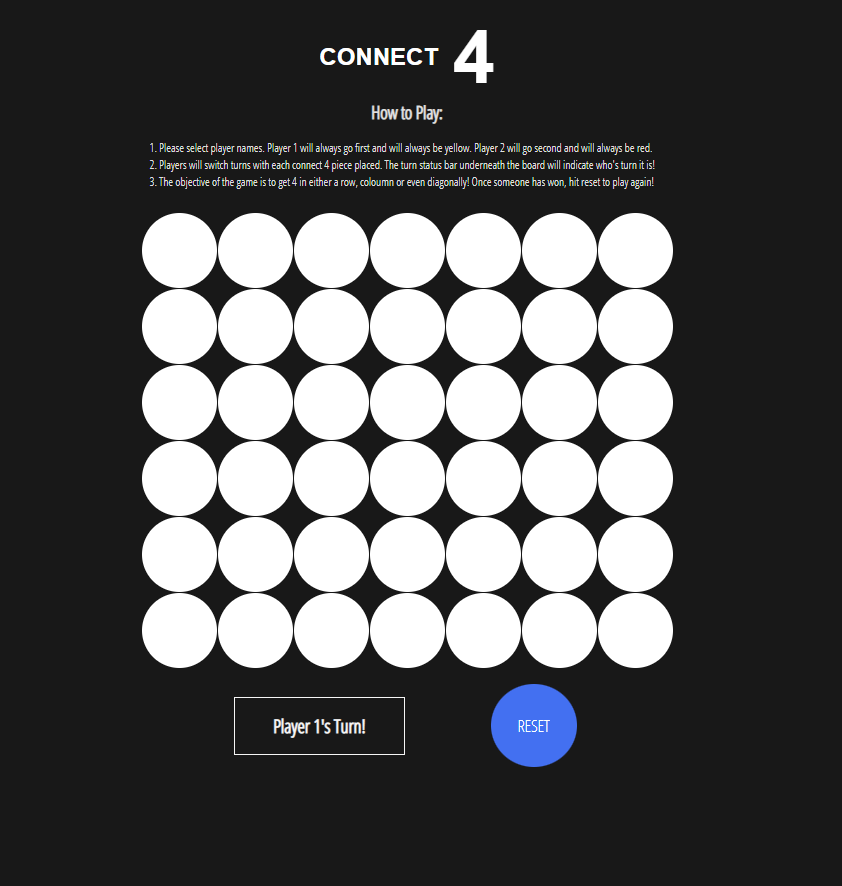
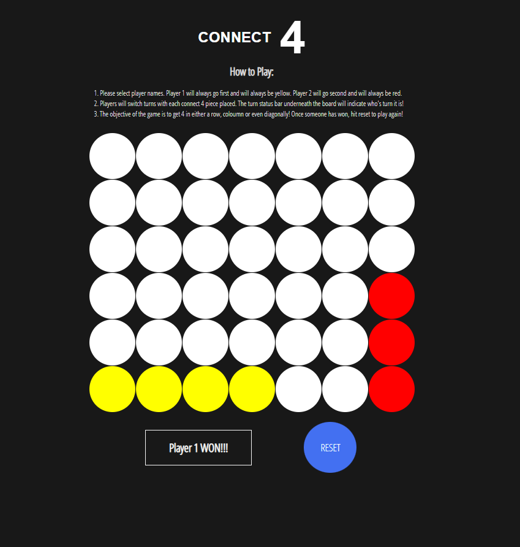

# **CONNECT 4**

## Rules and General Overview

Please select player names. Player 1 will always go first and will always be yellow. Player 2 will go second and will always be red.
Players will switch turns with each connect 4 piece placed. The turn status bar underneath the board will indicate who's turn it is!
The objective of the game is to get 4 in either a row, coloumn or even diagonally! 

## Special Conditions

Once someone has won, hit reset to play again!

- No player can have a turn twice in a row.
- Each individual player must select a slot to store the cell otherwise the game cannot continue. 
- No winner and if the board is full, it will stop the game and you must reset the board to play again.

## Screenshots

## Technologies Used

- HTML
- CSS
- JavaScript

## Play the Game

The game can be accessed [here](https://alianjumm.github.io/Connect-4/). It requires two players. Remember, yellow always goes first. When the game concludes, the winner will be displayed in the status bar. Good luck and follow the rules.

## Future Work

- **AI**. The future of this game would benefit from a fully functional (CPU) mode. This would allow the user to select wether they would like to play against another player or just the computer. This would also include a level of difficulty where the AI would play strategically so to attempt at beating the player. 